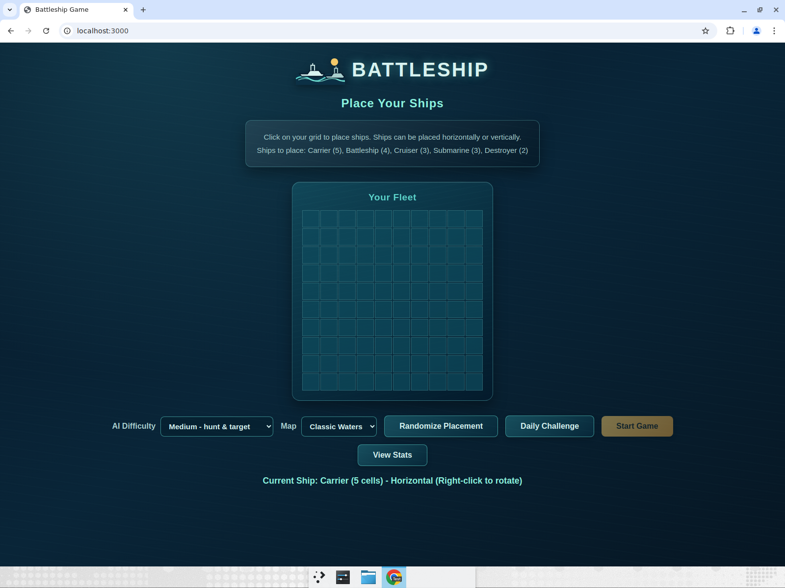
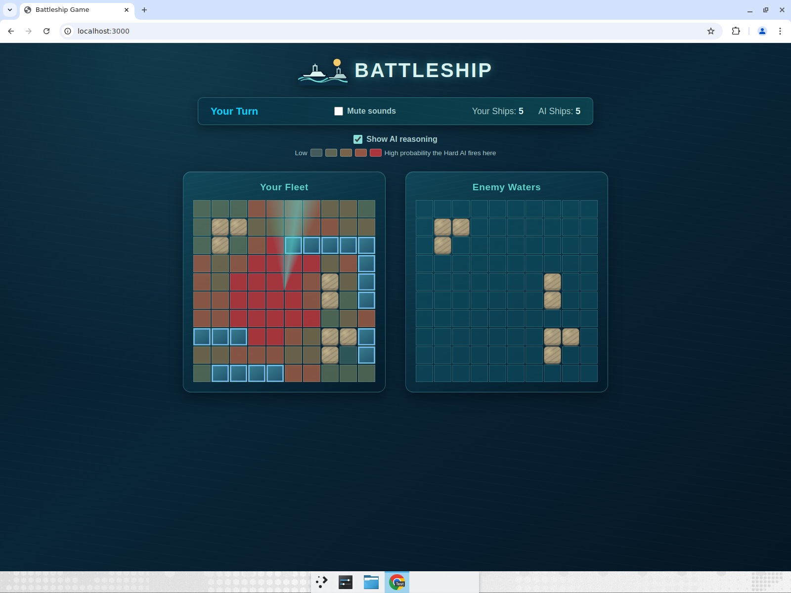
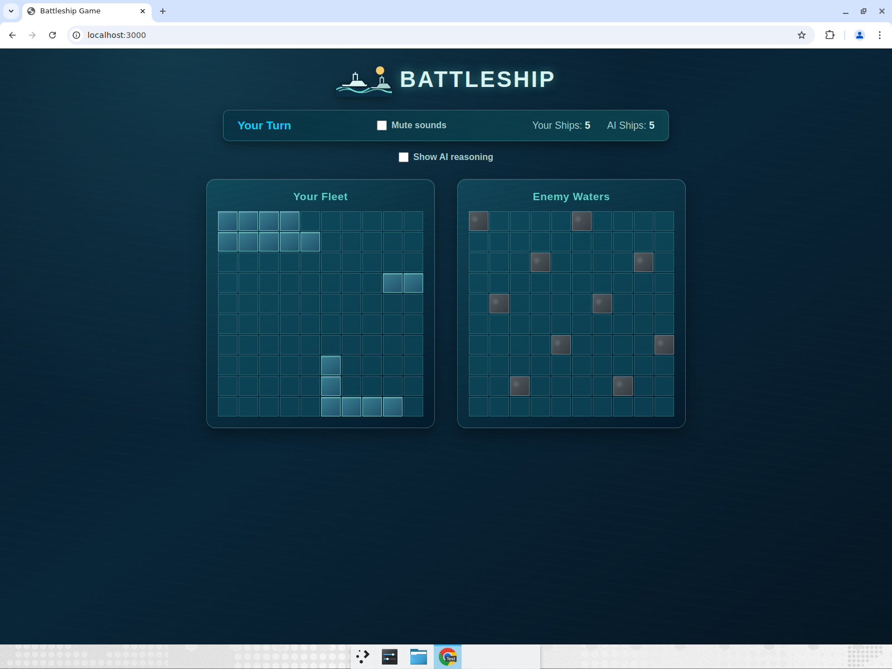
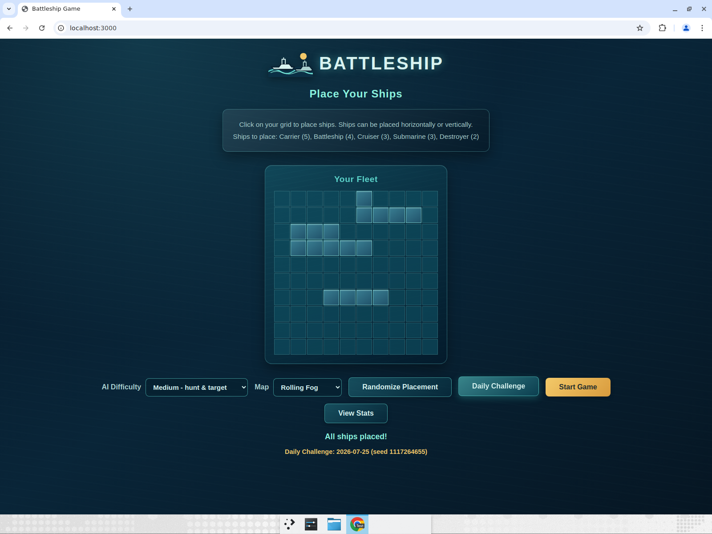
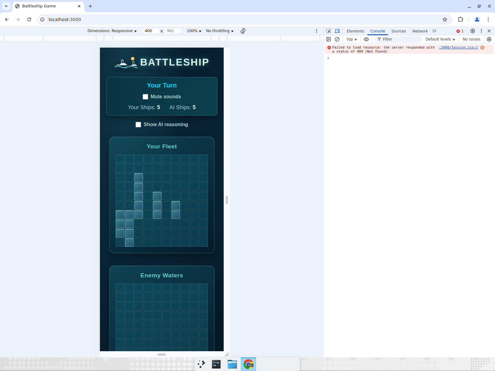

# Battleship Game

A browser-based Battleship game where a human plays against an AI opponent with
three selectable difficulty tiers.



## Features

- **Single-page web app** - HTML/CSS/JS only, no backend and no build step
- **"Convoy through the Archipelago" maritime theme** with an inline SVG warships logo
- **Standard 10x10 grid** with authentic ship set:
  - Carrier (5 cells)
  - Battleship (4 cells)
  - Cruiser (3 cells)
  - Submarine (3 cells)
  - Destroyer (2 cells)
- **Ship placement options**:
  - Manual placement with click-to-place
  - Right-click to rotate ship orientation
  - "Randomize" button for auto-placement
- **Three AI difficulty tiers** (selectable on the setup screen)
- **Three tactical maps** - Classic Waters, Archipelago, and Rolling Fog
- **Deterministic Daily Challenge** with a date-seeded map and AI fleet
- **"Show AI reasoning"** heatmap of the Hard AI's probability map
- **Synthesized Web Audio sound effects** with a persistent mute toggle
- **Game-feel animations** for hits, misses, sinks, screen shake, and sonar
- **Post-game analysis** grading every shot you fired
- **Local points and streaks** with a personal stats screen
- **Animated post-game replay** of your shot history and biggest mistakes
- **Victory/defeat end sequence** with an animated score counter and a contextual AI line
- **Local player profile** with a welcome/returning flow and an in-game score header
- **Responsive design** for different screen sizes

## AI Difficulty Tiers

| Tier | Module | Strategy | Avg. shots to sink the fleet* |
| --- | --- | --- | --- |
| Easy | `src/ai/easy.js` | Fires at a uniformly random cell it has not fired at yet. | ~96 |
| Medium | `src/ai/medium.js` | Hunt/target: random fire until it hits, then probes the orthogonally adjacent cells of the wounded ship until it sinks or the leads run out. | ~69 |
| Hard | `src/ai/hard.js` | Probability density (see below). | ~44 |

\* Measured by `src/simulation.test.js` over 200 seeded games per tier; every tier
faces the same 200 boards.

Every tier is a pure module: it receives the AI's knowledge of the opponent
board (`{ shots, sunkCells, remainingShipSizes }`, see `src/ai/knowledge.js`) and
returns the next `{ row, col }` to fire at. None of them touch the DOM.

### The probability-density algorithm (Hard)

For every ship that is still afloat, the Hard AI slides that ship across the
board in both orientations and keeps every placement that is still *possible* -
one that covers no miss and no cell of an already sunk ship. Each surviving
placement adds a weight to each un-fired cell it covers:

- a placement that covers no known hit adds `1`;
- a placement that covers `n` unresolved hits (hits on a ship that has not been
  sunk yet) adds `12^n`, so explanations of a wounded ship dominate the map;
- un-fired cells orthogonally adjacent to an unresolved hit get a further flat
  bonus.

The AI fires at the highest scoring cell, breaking ties randomly. Cells that were
already fired at always score `0`. The result is the "no hits yet" parity/centre
bias you would expect from a strong player, and a decisive finish-the-ship
behaviour once something is wounded.

## Show AI reasoning (heatmap)

During a Hard game, tick **Show AI reasoning** to overlay the Hard AI's live
probability map on your own fleet grid. Each un-fired cell is tinted from pale
yellow (low) to bright red (high) according to how likely the AI is to fire
there, and the legend above the boards maps the colours. The overlay refreshes
every turn, is drawn on top of the existing ship/hit/miss colours without
replacing them, and disappears as soon as the toggle is switched off. With Easy
or Medium selected the toggle explains that the heatmap is Hard-only.

## Maritime theme and maps

The visual direction is **Convoy through the Archipelago**: deep ocean and teal
water, sandy islands, container-yellow controls, warning-red interceptions, and
storm-grey fog. The inline SVG logo shows naval vessels heading into the
waters. Internal ship names and game logic remain unchanged.

The setup screen's **Map** selector offers:

- **Classic Waters** - open water with no islands or fog.
- **Archipelago** - fixed island cells that are impassable for both players:
  ships cannot be placed there and neither side can fire there. The Hard AI
  treats islands as invalid placements, so island cells always score `0` on its
  reasoning heatmap.
- **Rolling Fog** - a deterministic, turn-dependent storm-grey haze over
  un-fired Enemy Waters cells. Fog drifts after each player shot, is visual-only,
  and does not affect placement, firing logic, or the AI.





### Daily Challenge

The **Daily Challenge** button uses `dailySeed` and `dailyChallenge` from
`src/daily.js` to compute a deterministic map and AI fleet locally. There is no
backend: everyone using the same calendar date receives the same board. The
setup screen displays the challenge date and seed.



### Sound and game feel

`src/audio.js` synthesizes short Web Audio effects without asset files for fire,
hit, splash, sink, win, lose, and the Hard-AI sonar ping. The **Mute sounds**
toggle persists per browser/device in `localStorage` under
`battleship-muted-v1`.

Hits trigger an explosion and brief screen shake, misses create a water ripple,
sunk ships break apart before settling into their sunk state, and enabling the
Hard reasoning heatmap sends a sonar sweep across your fleet. These effects are
visual animations and are gated by `prefers-reduced-motion`.

## Post-game analysis

Every shot you fire is recorded. When the match ends, the game replays your shot
history through the same Hard probability engine and, for each turn, compares the
score of the cell you chose with the score of the best cell available at that
moment. The game-over screen shows:

- **Targeting efficiency** - the average of `your cell's score / best cell's score`
  across the match, as a percentage;
- **Biggest missed opportunities** - the three turns with the largest gap between
  your cell and the optimal one, with the cell you should have fired at.

## Player profile

On first launch the game asks for a player name and saves it locally
(`localStorage` key `battleship-profile-v1`, separate from the stats). Returning
players skip the prompt and instead see a **"Welcome back, [name]"** summary of
their total points and current/best streak before starting. During gameplay a
persistent header shows the player's name, current point total, and current
streak (with the active multiplier once a streak builds a bonus). A **New
Player** button on the welcome screen clears the saved profile and resets the
score so you can start over. The profile module (`src/profile.js`) is pure and
unit-tested; all UI reuses the existing scoring/stats system.

## Points and streaks

Wins award points based on the selected difficulty:

| Difficulty | Base points |
| --- | ---: |
| Easy | 2 |
| Medium | 5 |
| Hard | 10 |

Losses score 0 points. Consecutive wins multiply the base points by
`1 + 0.5 × (streak − 1)`, capped at ×3. The result is rounded **after** applying
the multiplier. The multiplier for wins 1 through 5+ is ×1.0, ×1.5, ×2.0, ×2.5,
and ×3.0.

For example:

- Hard 2nd straight win: `10 × 1.5 = 15` points
- Easy 3rd straight win: `2 × 2.0 = 4` points
- Hard 5th+ straight win: `10 × 3.0 = 30` points

For a non-whole raw result, the win screen shows the unrounded value and the
rounded award honestly; for example, a Medium 2nd straight win reads
`5 × 1.5 = 7.5 → 8`. Whole-number results omit the rounding note.

A loss resets the current streak to 0, but preserves the best streak. Stats
persist in `localStorage` under `battleship-stats-v1`, per browser/device with no
backend. The **View Stats** button on the setup and game-over screens opens a
stats screen showing total points, games played, wins/losses, win rate, current
and best streak, and a per-difficulty W/L table.

## Victory and defeat sequence

When the final shot ends a match, the result is **not** shown instantly: the game
holds on the final board for ~1 second so the last hit or sink animation registers,
then fades in a modal **over the still-visible final board** (the board is not
replaced by a separate screen).

- **Victory** plays the sink/break-apart animation on the last enemy ship and a
  win fanfare, then animates the awarded points **ticking up** from zero rather
  than snapping to the final number, adds a brief sparkle celebration, and shows
  a tiered contextual line from the AI's personality. Lines cover blowouts,
  close games, comebacks, and occasional historical wildcard quotes.
- **Defeat** applies a slower, desaturated transition to the board behind the
  modal while keeping the modal card itself full-color and readable, and shows a
  sportsmanlike (non-gloating) defeat line and `No points`.

Both modals offer **Post Game Stats** (primary label; it still opens the animated
shot replay below and starts autoplay) and **Play Again** (secondary), which
returns to ship placement. The contextual lines come from `src/personality.js`
and the animations reuse the existing sink, audio, and replay systems. The
counter, sparkle, and transition respect `prefers-reduced-motion`.

## Shot replay

The **Post Game Stats** button on the victory/defeat modal opens the shot replay and
steps through your shots move by move (the game-over screen's other button is
**Your Lifetime Stats**). Each frame redraws the Hard AI probability heatmap as it stood before
that shot, marks your chosen cell and the optimal cell (★), and shows the turn,
your cell, hit/miss result, and percentage of optimal in the caption.
Autoplay pauses noticeably longer on the three biggest-mistake turns, matching
the turns listed in Post-game analysis. Controls are **Prev**, **Play/Pause**,
**Next**, and **Restart**. On narrow/mobile viewports the replay grid scales to
fit its card so all ten columns stay visible without horizontal overflow.

## How to Play

1. **Place Your Ships**
   - Choose the AI difficulty
   - Click on your grid to place ships
   - Right-click to rotate between horizontal and vertical
   - Or click "Randomize Placement" for instant setup
   - Click "Start Game" when ready

2. **Battle**
   - Click on the "Enemy Waters" grid to attack
   - Red X = hit, White circle = miss
   - AI will automatically take its turn after you

3. **Win**
   - Sink all enemy ships to win
   - Don't let the AI sink your ships first!

## Mobile / responsive

At widths of 768px or less, the two boards stack vertically and cells shrink
from 35px to 28px. The layout has been checked at approximately 375–400px wide.



## Running the game locally

The game is loaded as ES modules, so it must be served over HTTP (browsers block
module imports on `file://`):

```bash
npx serve .
# then open http://localhost:3000
```

## Tests

```bash
npm install
npm test
```

`npm test` runs Vitest over the pure modules:

- `src/board.test.js` - grid, placement and fleet helpers
- `src/ai/easy.test.js`, `src/ai/medium.test.js`, `src/ai/hard.test.js` - one per tier
- `src/analysis.test.js` - post-game efficiency and worst-turn detection
- `src/scoring.test.js` - points, streak multipliers and persisted stats
- `src/replay.test.js` - chronological replay frames and mistake markers
- `src/maps.test.js` - map bounds, islands, and deterministic fog
- `src/daily.test.js` - date-seeded daily map and fleet determinism
- `src/personality.test.js` - contextual AI lines, recent-line history, and wildcard fallback
- `src/profile.test.js` - player profile creation, persistence, and reset
- `src/simulation.test.js` - 200 seeded games per tier, asserting Hard beats
  Medium beats Easy on average shots
- `src/board.test.js`, `src/ai/*test.js`, and `src/scoring.test.js` also cover
  blocked-cell, island-placement, and raw-scoring behavior

The suite currently contains 67 tests.

`test.html` additionally runs a handful of the same checks straight in the
browser (serve it over HTTP as above).

## Technical Details

- **Pure client-side** - Can be hosted on GitHub Pages or any static hosting
- **No runtime dependencies** - vanilla JavaScript ES modules; Vitest is a dev
  dependency used only for tests
- **No build step** - the files that are committed are the files that are served

## Deployment

This game is designed to be deployed on GitHub Pages:

1. Push the repository to GitHub
2. Enable GitHub Pages in repository settings
3. Select the main branch as source

GitHub Pages serves `src/**` as static files with the correct MIME type, so the
ES module imports work as-is - no bundler required.

## Files

- `index.html` - Main game structure
- `style.css` - Maritime theme, board states, animations, heatmap, analysis, stats and replay screens
- `game.js` - DOM wiring: setup, maps, fog, daily challenge, turn loop, audio hooks, heatmap, analysis, stats and replay rendering
- `src/constants.js` - Grid size and ship definitions
- `src/board.js` - Pure grid/placement helpers (`canPlaceShip`, `placeShip`, `getAdjacentCells`, ...)
- `src/rng.js` - Seeded PRNG for deterministic tests and simulations
- `src/ai/knowledge.js` - What an AI knows about the board it fires at
- `src/ai/easy.js`, `src/ai/medium.js`, `src/ai/hard.js` - The three difficulty tiers
- `src/ai/index.js` - `createAI(difficulty, rng)` wrapper used by the game
- `src/analysis.js` - Post-game shot grading
- `src/scoring.js` - LocalStorage-backed points and streaks
- `src/replay.js` - Post-game replay frame builder
- `src/maps.js` - Pure map, island, and drifting-fog definitions
- `src/daily.js` - Deterministic date-seeded daily challenge generator
- `src/audio.js` - Safe Web Audio SFX engine and persisted mute state
- `src/personality.js` - Contextual victory/defeat lines and wildcard quotes
- `src/profile.js` - LocalStorage-backed player profile
- `src/simulation.js` - Headless games used by the difficulty simulations
- `test.html` - In-browser smoke tests
- `manual-test.html` - Manual testing guide
- `BUGFIXES.md` - Summary of bugs found during development and how they were fixed
- `DEBUG.md` - Original debugging notes

## License

Free to use and modify.
